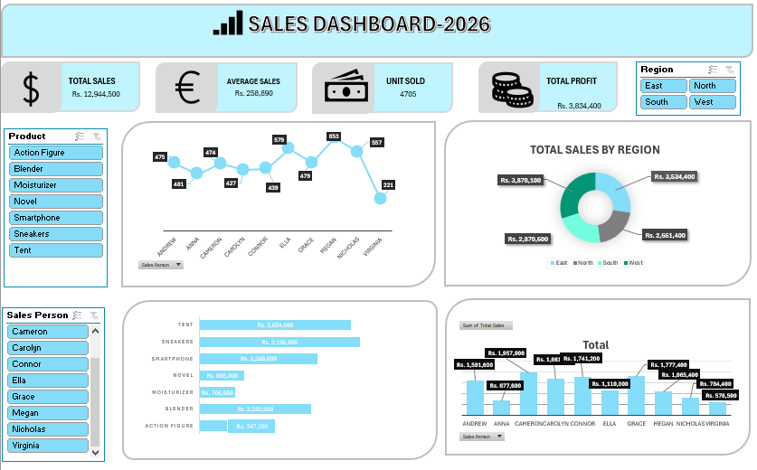

# Sales Dashboard 2026

## Overview
The **Sales Dashboard 2026** is an interactive business intelligence dashboard designed to provide a comprehensive overview of sales performance across products, sales personnel, and regions. It enables users to analyze key sales metrics, monitor profitability, identify top-performing products, and evaluate regional sales distribution through dynamic visualizations and filters.

---

## Features

### KPI Summary Cards
The dashboard displays the following key performance indicators (KPIs):

- **Total Sales:** Rs. 12,944,500
- **Average Sales:** Rs. 258,890
- **Units Sold:** 4,705
- **Total Profit:** Rs. 3,834,400

### Interactive Filters
Users can filter dashboard data using:

#### Product Filter
Available products:
- Action Figure
- Blender
- Moisturizer
- Novel
- Smartphone
- Sneakers
- Tent

#### Sales Person Filter
Available sales representatives:
- Cameron
- Carolyn
- Connor
- Ella
- Grace
- Megan
- Nicholas
- Virginia

#### Region Filter
- East
- North
- South
- West

---

## Dashboard Visualizations

### 1. Sales Trend by Sales Person
A line chart displaying total sales performance for each sales representative, helping identify high and low performers.

### 2. Total Sales by Region
A donut chart showing the contribution of each region to overall sales.

### 3. Product-wise Sales Analysis
A horizontal bar chart presenting sales revenue generated by each product category.

### 4. Sales Person Performance Comparison
A clustered column chart comparing total sales among sales representatives.

---

## Business Insights

The dashboard helps answer questions such as:

- Which product generates the highest revenue?
- Which sales representative has the best performance?
- Which region contributes the most to total sales?
- How are sales distributed across different products and regions?
- What is the overall profitability of the business?

---

## Technologies Used

- Microsoft Excel
  - Pivot Tables
  - Pivot Charts
  - Slicers
  - Data Modeling
  - Dashboard Design

> This dashboard can also be recreated using Power BI, Tableau, or other BI tools.

---

## Dataset Structure

| Column Name | Description |
|------------|-------------|
| Order ID | Unique order identifier |
| Product | Product category |
| Region | Sales region |
| Sales Person | Representative handling the sale |
| Units Sold | Quantity sold |
| Sales Amount | Revenue generated |
| Profit | Profit earned |
| Order Date | Date of transaction |

---

## How to Use

1. Open the dashboard workbook.
2. Use the **Product**, **Sales Person**, and **Region** filters to refine the analysis.
3. Review KPI cards for overall performance metrics.
4. Analyze charts to identify trends and business opportunities.
5. Reset filters to return to the complete dataset view.

---

## Key Benefits

- Real-time performance monitoring
- Interactive data exploration
- Product and regional sales analysis
- Sales team performance evaluation
- Executive-level reporting and decision support

---

## Dashboard Preview

---

## Future Enhancements

- Monthly and yearly trend analysis
- Profit margin tracking
- Customer segmentation
- Forecasting and predictive analytics
- Mobile-responsive dashboard version
- Automated data refresh

---

## Author

**Your Name**

For questions or suggestions, feel free to connect or open an issue in this repository.

---

## License

This project is licensed under the MIT License.